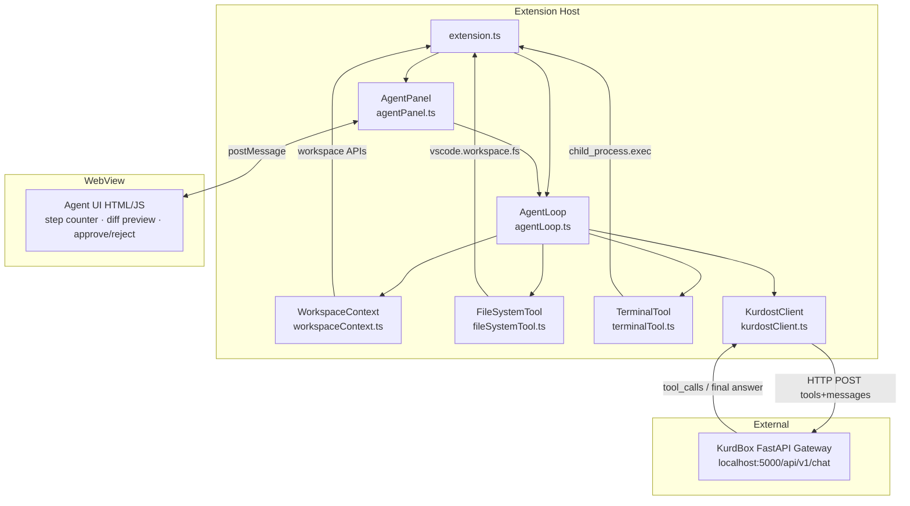

# Design Document: kurdbox-agent

## Overview

The `kurdbox-agent` feature transforms the KurdBox VS Code extension into a full AI coding agent. It adds a tool-calling loop where the LLM can read/write files, run terminal commands, and inspect workspace context — all exposed through a new AgentPanel WebView. The design is layered on top of the existing `ChatPanel` and `KurdostClient`, extending rather than replacing them.

The core loop is: **User Task → WorkspaceContext → LLM Request (with tools) → parse tool_calls → execute tools → feed results back → repeat until final answer or iteration limit**.

---

## Architecture



### Key Design Decisions

1. **AgentLoop is separate from AgentPanel** — the loop is a pure TypeScript class with no WebView dependency, making it testable and reusable.
2. **Tool execution is synchronous within each loop iteration** — all tool calls in one LLM response are executed in parallel, then a single combined result message is sent back.
3. **Approval gates live in AgentPanel** — the loop suspends and emits an `approvalRequest` event; the panel resolves or rejects it via a `Promise`. This keeps the loop decoupled from UI concerns.
4. **KurdostClient extended, not replaced** — the existing `chat()` function is augmented with optional `tools` and `toolChoice` parameters. Non-agent callers are unaffected.
5. **No new npm dependencies** — `child_process` is Node built-in; diff generation uses a simple line-diff algorithm implemented inline to avoid adding packages.

---

## Components and Interfaces

### 1. Tool Definitions (`src/agent/tools/fileSystemTool.ts` and `terminalTool.ts`)

Each tool exports:
- A **JSON Schema object** (`ToolDefinition`) for inclusion in the LLM request
- An **execute function** that receives parsed args and returns `ToolResult`

```typescript
// Shared types (can live in src/agent/types.ts)
export interface ToolDefinition {
    type: 'function';
    function: {
        name: string;
        description: string;
        parameters: {
            type: 'object';
            properties: Record<string, { type: string; description: string }>;
            required: string[];
        };
    };
}

export interface ToolResult {
    tool_call_id: string;
    role: 'tool';
    content: string;        // JSON string or plain text result
    isError: boolean;
    affectedPath?: string;  // absolute path, if a file was touched
}

export interface ToolCall {
    id: string;
    type: 'function';
    function: {
        name: string;
        arguments: string;  // JSON string
    };
}
```

**FileSystem Tools** (`fileSystemTool.ts`):

| Tool name | Parameters | Description |
|---|---|---|
| `read_file` | `path: string` | Read UTF-8 content of a file |
| `write_file` | `path: string`, `content: string` | Write/overwrite a file (requires approval) |
| `create_file` | `path: string`, `content: string` | Create a new file; error if exists |
| `delete_file` | `path: string` | Delete a file (always requires approval) |
| `list_directory` | `path: string` | List entries in a directory |

**Terminal Tool** (`terminalTool.ts`):

| Tool name | Parameters | Description |
|---|---|---|
| `run_command` | `command: string` | Execute a shell command; returns stdout+stderr |

### 2. WorkspaceContext (`src/agent/workspaceContext.ts`)

```typescript
export interface WorkspaceContextData {
    workspaceRoot: string;
    fileTree: string;           // ASCII tree, max 3 levels / 200 entries
    activeFileContent?: string; // max 100 KB
    activeFilePath?: string;
    openFilePaths: string[];
    gitDiff?: string;           // max 10 KB
}

export async function collectWorkspaceContext(): Promise<WorkspaceContextData>
```

Collection strategy:
- File tree: recursive `vscode.workspace.fs.readDirectory()` with depth counter; stops at 3 and caps at 200 entries
- Active file: `vscode.window.activeTextEditor?.document`; skips if > 100 KB
- Git diff: spawns `git diff HEAD` via `child_process.exec` with 5s timeout; omits on any error
- Open files: `vscode.workspace.textDocuments` filtered to files with a URI scheme of `file`

### 3. AgentLoop (`src/agent/agentLoop.ts`)

The loop manages state and orchestrates tool execution.

```typescript
export type LoopStatus = 'idle' | 'running' | 'stopped' | 'complete' | 'error';

export interface AgentLoopOptions {
    maxIterations?: number;             // default 20
    requireCommandConfirmation?: boolean;
    onStepUpdate?: (step: number, max: number) => void;
    onToolCall?: (call: ToolCall) => void;
    onToolResult?: (result: ToolResult) => void;
    onApprovalRequired?: (request: ApprovalRequest) => Promise<boolean>;
    onFinalAnswer?: (text: string, summary: TaskSummary) => void;
    onError?: (error: Error) => void;
    onStatusChange?: (status: LoopStatus) => void;
}

export interface ApprovalRequest {
    type: 'write_file' | 'delete_file' | 'run_command';
    toolCallId: string;
    path?: string;
    content?: string;
    diff?: string;
    command?: string;
}

export interface TaskSummary {
    iterations: number;
    toolsUsed: string[];
    filesChanged: string[];
    stoppedByUser: boolean;
    hitIterationLimit: boolean;
}
```

**Loop algorithm:**

```
function runLoop(userMessage, context, tools, options):
    messages = [systemPrompt(context, tools), { role: 'user', content: userMessage }]
    iteration = 0
    status = 'running'

    while iteration < maxIterations and status == 'running':
        iteration++
        onStepUpdate(iteration, maxIterations)

        response = await kurdostClient.chatWithTools(messages, tools)

        if response has no tool_calls:
            status = 'complete'
            onFinalAnswer(response.content, buildSummary())
            return

        // Execute tool calls (in parallel where safe)
        toolResults = []
        for each toolCall in response.tool_calls:
            onToolCall(toolCall)
            result = await executeTool(toolCall, options)
            onToolResult(result)
            toolResults.push(result)

        // Append assistant message + tool results to history
        messages.push({ role: 'assistant', tool_calls: response.tool_calls })
        messages.push(...toolResults)

    if iteration >= maxIterations:
        status = 'complete'
        notifyUser("Iteration limit reached")
```

**Stop mechanism:** A `stop()` method sets an internal `_stopRequested` flag. The loop checks this flag at the top of each iteration and before each tool execution.

### 4. AgentPanel (`src/agent/agentPanel.ts`)

Extends the pattern from `ChatPanel` as a `vscode.WebviewViewProvider`. Key differences:

- Mode toggle: chat vs. agent
- Step counter display (`Step N / 20`)
- Tool call log (collapsible list of executed tools)
- Diff preview pane with Approve/Reject buttons
- Stop button (visible during active loop)
- Workspace root badge in toolbar

**Message protocol (extension ↔ WebView):**

| Direction | Message type | Payload |
|---|---|---|
| → WebView | `agentModeChange` | `{ active: boolean, workspaceRoot: string }` |
| → WebView | `stepUpdate` | `{ step: number, max: number }` |
| → WebView | `toolCallLog` | `{ name: string, args: object, status: 'pending'\|'done'\|'error' }` |
| → WebView | `approvalRequest` | `{ type, path?, diff?, command?, callId }` |
| → WebView | `taskSummary` | `{ iterations, toolsUsed, filesChanged }` |
| → WebView | `loopStopped` | `{}` |
| ← Extension | `agentToggle` | `{}` |
| ← Extension | `agentSend` | `{ text: string, model: string, provider: string }` |
| ← Extension | `approvalResponse` | `{ callId: string, approved: boolean }` |
| ← Extension | `stopLoop` | `{}` |

The existing `send`, `streamStart/Chunk/End`, `error`, `providers`, etc. messages are retained unchanged for chat mode.

### 5. KurdostClient Extension (`src/api/kurdostClient.ts`)

Add a new exported function:

```typescript
export interface ChatWithToolsOptions {
    token: string;
    messages: OpenAIMessage[];
    model: string;
    provider?: string;
    tools?: ToolDefinition[];
    toolChoice?: 'auto' | 'none';
}

export interface LLMToolResponse {
    content: string | null;
    tool_calls?: ToolCall[];
    finishReason: 'stop' | 'tool_calls' | 'length' | string;
}

export async function chatWithTools(options: ChatWithToolsOptions): Promise<LLMToolResponse>
```

The function POSTs to `/api/v1/chat` (non-streaming) with the `tools` array included in the body. It parses `choices[0].message` and returns both `content` and `tool_calls`. If the response is malformed, it throws a descriptive error.

**OpenAI message format** (union type):

```typescript
type OpenAIMessage =
    | { role: 'system'; content: string }
    | { role: 'user'; content: string }
    | { role: 'assistant'; content: string | null; tool_calls?: ToolCall[] }
    | { role: 'tool'; tool_call_id: string; content: string };
```

---

## Data Models

### System Prompt Template

The system prompt sent with every agent request includes:
1. Agent persona and capabilities overview
2. Workspace context (file tree, active file, git diff, open files)
3. Tool schema (JSON)
4. Behavioral instructions (path safety, approval gates, iteration awareness)

```
You are KurdBox Agent, an AI coding assistant with direct access to the user's workspace.

## Workspace
Root: {workspaceRoot}
Open files: {openFilePaths}
Active file: {activeFilePath}

## File Tree
{fileTree}

## Active File Content
{activeFileContent}

## Git Diff
{gitDiff}

## Available Tools
{toolsJson}

## Rules
- Always use relative paths; they will be resolved against the workspace root.
- Before writing or deleting files, the user must approve.
- After completing the task, summarize what you changed.
```

### In-Memory Conversation State

The `AgentLoop` holds:

```typescript
interface AgentState {
    messages: OpenAIMessage[];   // full conversation history
    status: LoopStatus;
    currentIteration: number;
    toolsUsed: string[];
    filesChanged: string[];
    _stopRequested: boolean;
}
```

This state is **never persisted to disk** (Requirement 8.5). When the WebView disposes, `AgentPanel.dispose()` calls `agentLoop.reset()` which clears `messages` (Requirement 8.6).

### Path Security

All path resolution flows through a single utility:

```typescript
function resolveSecurePath(relativePath: string, workspaceRoot: vscode.Uri): vscode.Uri {
    // 1. Normalize separators
    // 2. Join with workspaceRoot
    // 3. Resolve '..' segments
    // 4. Check resolved.fsPath.startsWith(workspaceRoot.fsPath)
    // 5. Throw SecurityError if not within root
}
```

---

## Correctness Properties

*A property is a characteristic or behavior that should hold true across all valid executions of a system — essentially, a formal statement about what the system should do. Properties serve as the bridge between human-readable specifications and machine-verifiable correctness guarantees.*

### Property 1: Path Containment Invariant

*For any* relative path string passed to a FileSystem tool, the resolved absolute path SHALL be within the Workspace_Root. If path traversal components (`..`) would escape the root, the tool SHALL return a security error and not touch the filesystem.

**Validates: Requirements 3.7, 8.1, 8.2**

### Property 2: Write-After-Reject Leaves File Unchanged

*For any* file and any proposed content, if the user rejects the approval step for a `write_file` or `delete_file` tool call, the file's content after the rejection SHALL be identical to its content before the tool call was issued.

**Validates: Requirements 5.3, 5.4**

### Property 3: Terminal Output Truncation Invariant

*For any* command that produces output, if the combined stdout+stderr length exceeds 50 KB, the ToolResult content length SHALL be ≤ 50 KB plus the truncation notice, and SHALL contain the truncation notice string.

**Validates: Requirements 4.5**

### Property 4: Iteration Count Monotonicity

*For any* agent task, the step counter reported to the UI SHALL be monotonically increasing, and the loop SHALL execute at most `maxIterations` (default 20) LLM calls before halting.

**Validates: Requirements 6.3, 6.5**

### Property 5: Tool Error Continuation

*For any* sequence of tool calls in a loop, if one tool returns an error ToolResult, the loop SHALL include that error in the next LLM message and continue the loop (not abort), unless the stop flag has been set.

**Validates: Requirements 6.6**

### Property 6: Security Path Rejection Does Not Affect Filesystem

*For any* path that resolves outside the Workspace_Root, invoking any FileSystem tool SHALL return a security error ToolResult and SHALL leave the filesystem in exactly the same state as before the call.

**Validates: Requirements 3.7, 8.1, 8.2**

### Property 7: Conversation History Never Written to Disk

*For any* agent session, the in-memory message array containing conversation history and tool results SHALL not be serialized to any file, database, or persistent storage at any point during the session.

**Validates: Requirements 8.5**

### Property 8: Full-File Replacement Always Shows Diff

*For any* full-file replacement proposal, the AgentPanel SHALL compute and display a diff between current file content and proposed content before applying, even when the change format is full replacement rather than unified diff.

**Validates: Requirements 5.5, 5.6**

---

## Error Handling

| Scenario | Handling |
|---|---|
| No workspace folder open | Agent cancels request; posts error to WebView regardless of notification delivery success |
| Git not installed / not a repo | Git diff omitted from context; loop continues |
| File not found (read_file) | Returns descriptive `file-not-found` ToolResult; loop continues |
| Path traversal detected | Returns `SecurityError` ToolResult; no filesystem access |
| Command timeout (>30s) | Process killed; returns `timeout error` ToolResult |
| Command output >50KB | Output truncated + notice appended |
| LLM returns malformed response | Returns `parse error` ToolResult; raw response logged to console |
| Iteration limit reached | Loop stops; user notified; task summary shown |
| write_file apply fails (context mismatch) | Returns failure ToolResult; file NOT silently overwritten |
| create_file on existing path | Returns `already exists` ToolResult; file not touched |
| WebView disposed mid-loop | `dispose()` sets stop flag; loop halts at next checkpoint; state cleared |
| Token expired (401) | `chatWithTools` throws; `AgentLoop` catches, calls `onError`, sets status to `error` |

---

## Testing Strategy

### Unit Tests (Mocha / VS Code Extension Test Runner)

Focus on pure logic and mocked VS Code APIs:

- **Path security**: `resolveSecurePath` with valid paths, traversal paths, edge cases (`./`, `../`, absolute paths)
- **Output truncation**: `terminalTool` with mocked output at 0B, 49KB, 50KB, 100KB
- **Loop iteration limit**: `AgentLoop` with a mock LLM that always returns tool_calls; assert loop stops at 20
- **Stop flag**: assert `stop()` halts loop after in-flight call completes
- **Tool error continuation**: mock a tool that returns an error; assert loop sends error to LLM and continues
- **Context collection**: mock `vscode.workspace.fs` and `vscode.window`; assert field limits (depth, size)

### Property-Based Tests (fast-check)

Use [fast-check](https://github.com/dubzzz/fast-check) — a TypeScript-native PBT library.

**Configuration**: minimum 100 runs per property.

**Property 1 — Path Containment Invariant**
```
fc.assert(fc.asyncProperty(
    fc.string(),  // arbitrary relative path (may contain .., spaces, unicode)
    async (relativePath) => {
        const result = resolveSecurePath(relativePath, mockWorkspaceRoot);
        // Either resolves within root, or threw SecurityError — never silently escapes
    }
), { numRuns: 500 })
```
Tag: `Feature: kurdbox-agent, Property 1: path containment invariant`

**Property 2 — Write-After-Reject Leaves File Unchanged**
```
fc.assert(fc.asyncProperty(
    fc.string(),               // relative path
    fc.string(),               // original content
    fc.string(),               // proposed content
    async (path, original, proposed) => {
        // Write original, attempt write with reject, read back → equals original
    }
), { numRuns: 100 })
```
Tag: `Feature: kurdbox-agent, Property 2: write-after-reject leaves file unchanged`

**Property 3 — Terminal Output Truncation**
```
fc.assert(fc.asyncProperty(
    fc.string({ minLength: 0, maxLength: 200_000 }),  // arbitrary command output
    async (output) => {
        const result = applyOutputCap(output, 50 * 1024);
        assert(Buffer.byteLength(result, 'utf8') <= 50 * 1024 + NOTICE_OVERHEAD);
        if (Buffer.byteLength(output, 'utf8') > 50 * 1024) {
            assert(result.includes('[truncated]'));
        }
    }
), { numRuns: 200 })
```
Tag: `Feature: kurdbox-agent, Property 3: terminal output truncation invariant`

**Property 4 — Iteration Count Monotonicity**
```
fc.assert(fc.asyncProperty(
    fc.integer({ min: 1, max: 20 }),  // maxIterations setting
    async (maxIter) => {
        const steps = [];
        const loop = new AgentLoop({ maxIterations: maxIter, onStepUpdate: (s) => steps.push(s) });
        await loop.run(...withMockInfiniteToolLoop());
        assert(steps.every((s, i) => i === 0 || s > steps[i-1]));  // monotone
        assert(steps.length <= maxIter);
    }
), { numRuns: 100 })
```
Tag: `Feature: kurdbox-agent, Property 4: iteration count monotonicity`

**Property 5 — Tool Error Continuation**
```
fc.assert(fc.asyncProperty(
    fc.array(fc.boolean(), { minLength: 1, maxLength: 20 }),  // which iterations error
    async (errorPattern) => {
        // Loop with mock LLM that stops after N iterations
        // Assert loop never stops early due to a tool error
        // Assert each error was forwarded to LLM as a tool role message
    }
), { numRuns: 100 })
```
Tag: `Feature: kurdbox-agent, Property 5: tool error continuation`

### Integration Tests

- **End-to-end agent task**: Start agent with a real (or mock) LLM response; assert file is created in temp workspace dir
- **Diff display**: Assert `approvalRequest` message contains a non-empty `diff` field for both unified-diff and full-replacement scenarios
- **Stop during loop**: Assert that calling `stop()` mid-loop results in `loopStopped` message and no further tool executions

### Testing Infrastructure

- Mock `vscode.workspace.fs` with an in-memory filesystem for FileSystem tool tests
- Mock `child_process.exec` for TerminalTool tests
- Mock `KurdostClient.chatWithTools` for AgentLoop tests
- All property tests run against pure TypeScript functions (no VS Code APIs directly tested)
